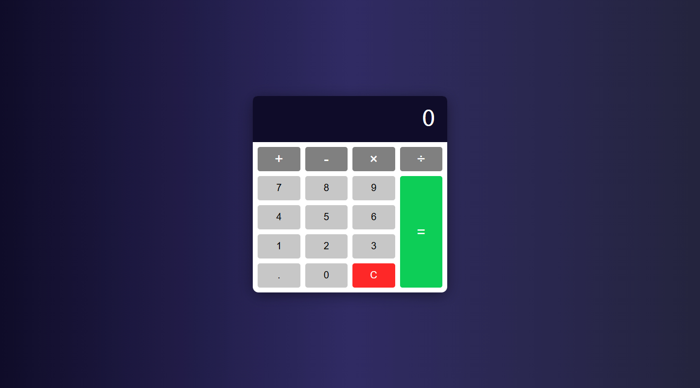

# Calculator | ZTM JS Web Projects Course

**Project 17/20**

A simple yet powerful Calculator App built with HTML, CSS, and JavaScript. It supports basic arithmetic operations, handles decimals, and provides a clean responsive UI.

---

## 📚 Table of Contents

- [🔎 Overview](#-overview)
  - [📸 Screenshot](#-screenshot)
  - [🔗 Links](#-links)
  - [📌 Features](#-features)
  - [🛠️ Built with](#️-built-with)
- [🧠 My process](#-my-process)
  - [🗃️ Useful resources](#️-useful-resources)
  - [🔙 Previous Project](#-previous-project)
  - [🔜 Next Project](#-next-project)
- [👤 Author](#-author)
  - [🌐 Connect with Me](#-connect-with-me)
  - [💻 Coding Profiles](#-coding-profiles)

---

## 🔎 Overview

### 📸 Screenshot

### 🔗 Links

- [🔴 Live Demo](https://dalascript.github.io/calculator/)
- [🗂️ GitHub Repository](https://github.com/DalaScript/calculator)

### 📌 Features

- ✅ Perform basic operations
- ✅ Clear button to reset the calculator instantly
- ✅ Decimal support for precise calculations
- ✅ Prevents multiple decimals in a single number
- ✅ Continuous calculations (chain operations without resetting)
- ✅ Responsive design

### 🛠️ Built with

- HTML5
- CSS3
- JavaScript

---

## 🧠 My Process

### 🗃️ Useful resources

- [uiGradients – Background Gradients](https://uigradients.com/#MoonlitAsteroid)
- [W3Schools – Custom Scrollbar](https://www.w3schools.com/howto/howto_css_custom_scrollbar.asp)
- [MDN – CSS Grid Layout](https://developer.mozilla.org/en-US/docs/Web/CSS/CSS_grid_layout)
- [MDN – grid-column](https://developer.mozilla.org/en-US/docs/Web/CSS/grid-column)
- [MDN – grid-row](https://developer.mozilla.org/en-US/docs/Web/CSS/grid-row)
- [MDN – Number Object](https://developer.mozilla.org/en-US/docs/Web/JavaScript/Reference/Global_Objects/Number)

### 🔙 Previous Project

- Drag And Drop | *Project 16/20* → [View Repository](https://github.com/DalaScript/drag-and-drop)

### 🔜 Next Project

- Splash Page | *Project 18/20* → [View Repository](https://github.com/DalaScript/splash-page)

---

## 👤 Author

### 🌐 Connect with Me

- [Instagram](https://www.instagram.com/DalaScript)
- [YouTube](https://www.youtube.com/@DalaScript)

### 💻 Coding Profiles

- [freeCodeCamp](https://www.freecodecamp.org/DalaScript)
- [FrontendMentor](https://www.frontendmentor.io/profile/DalaScript)
- [GitHub](https://github.com/DalaScript)

*🙌 Thanks for checking out my project! More coming soon. Stay tuned 🚀*
